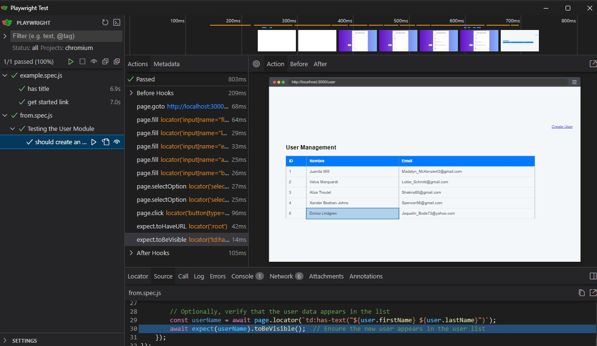
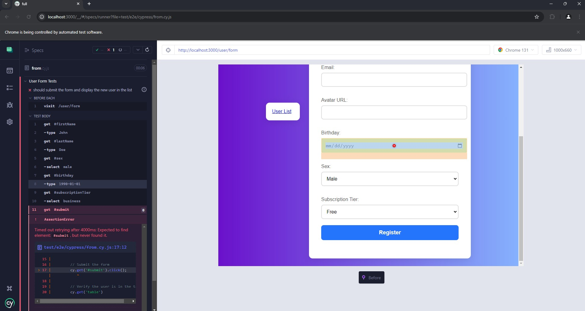
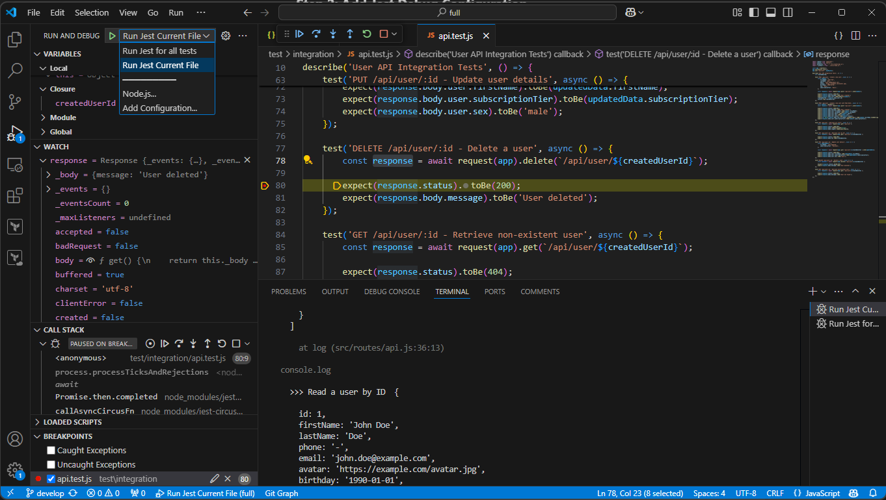

# User API with ESM and Jest Tests

This project demonstrates a simple User API implemented with Express.js and tested using Jest and Supertest. The API allows creating, retrieving, updating, and deleting user records, with additional user data such as avatar, birthday, sex, and subscription tier. 

## Purpose

The purpose of this project is to:
- Showcase a simple API with full CRUD functionality.
- Use ESM (ECMAScript Modules) in a Node.js project.
- Provide integration tests for the API using Jest and Supertest.
  
## Project Structure
```
src/
 ├── routes/
 │   ├── frontend.js       # Routes for HTML pages (form and list)
 │   ├── api.js            # Routes for user CRUD (API)
 ├── views/
 │   ├── form.html         # User registration page
 │   ├── list.html         # User listing page
 ├── models/
 │   ├── user.js           # In-memory user data structure, or shared user list 
 ├── services/
 │   ├── user.js           # Functional user service with the CRUD implementation
 ├── server.js             # Main file
test/       
 ├── ...                   # Test Project Structure 
```

### Description of Files:
- **`/routes/api.js`**: Contains the Express.js API routes for user CRUD operations.
- **`/routes/frontend.js`**: Serves the frontend user registration form.
- **`/views/form.html`**: The HTML form for user registration.
- **`/tests/api.test.mjs`**: Contains Jest and Supertest integration tests for the API.
- **`jest.config.cjs`**: Jest configuration file for ESM compatibility.
- **`server.js`**: Main entry point that sets up the Express server.

## Test Project Structure
```
src/
 ├── ...                   # Application Project Structure 
test/
 ├── e2e/                  # All End-To-End test cases 
 │   ├── cypress/          # All test based on Cypress
 │   │   ├── from.spec.js          
 │   ├── playwright/       # All test based on Playwright
 │   │   ├── from.spec.js      
 ├── integration/
 │   ├── api.test.js       # API User CRUD integration test 
 ├── unit/
 │   ├── user.srv.test.js  # User service Unit test
 ├── utils/
 │   ├── fake.js           # Utilities to get fake data
 ├── reports/              # Reports directory
 │   └── cypress/
 │   │   ├── screenshots/
 │   │   ├── videos/
 │   │   └── mochawesome.html
 │   └── playwright/
 │       └── index.html
jest.config.js             # Jest configuration file (Unit & Integration test)
playwright.config.js       # Playwright configuration file (End To End test)
```

## Running the Application
- `npm install`
- `npm start`
- GET http://localhost:3000

## E2E with Playright
- Install 
  - `npm init playwright@latest`
- Files
  - [Config File](./playwright.config.js)
  - [Reports](./reports/playwright/index.html)
- Run 
  - Run test in CLI mode: `npm run test:e2e:pg:run` 
  - Run test in Browser mode:`npm run test:e2e:pg:ui`
  - Run and generate Reports: `npm run test:e2e:pg:report`
  

## E2E with Cypress
- Install 
  - `npm install cypress --save-dev`
- Files
  - [Config File](./cypress.config.js)
  - [Reports](./reports/cypress/index.html)
- Run 
  - Run test in CLI mode: `npm run test:e2e:cy:run` 
  - Run test in Browser mode:`npm run test:e2e:cy:ui`
  

## Unit and Integration Test 
- `npm test`
- Debugging from VSCode IDE
 

## Testing Stack

- E2E
  - [Playwright](https://playwright.dev/)
  - [Cypress](https://www.cypress.io/)
  - [Vitest](https://vitest.dev/guide/)
  - [Selenium](https://www.selenium.dev/)
  - [rrweb: Record and replay the web](https://www.rrweb.io/)
  - [Jest](https://jestjs.io/)

- Integration 
  - [Newman + Postman](https://youtu.be/ZlTzOIv88o8)

- Unit Test 
  - [Java](https://www.guru99.com/es/junit-vs-testng.html)
    - [JUnit](https://junit.org/junit5/)
    - [TestNG](https://testng.org/)
  - PHP
    - (PHPUnit)[https://phpunit.de/index.html]

- Compatibility
  - [BrowserStack](https://www.browserstack.com/) 

- Accessibility
  - Axe DevTools - Web Accessibility Testing
    - [Chrome Addon](https://chromewebstore.google.com/detail/axe-devtools-web-accessib/lhdoppojpmngadmnindnejefpokejbdd?pli=1)
  
  - LightHouse  
    - [Metrics](https://lighthouse-metrics.com/)
    - [Chrome Addon](https://chromewebstore.google.com/detail/lighthouse/blipmdconlkpinefehnmjammfjpmpbjk?hl=es)

- Performance
  - [Gatling](https://gatling.io/)
  - [JMeter](https://jmeter.apache.org/)
  - [BlazeMeter](https://www.blazemeter.com/)

- Security 
  - [OWASP ZAP](https://es.wikipedia.org/wiki/OWASP_ZAP)

- Mobile
  - [Appium](https://appium.io/docs/en/latest/)

- Framework
  - [Robot Framework](https://robotframework.org/): Robot Framework is an open source automation framework for test automation and robotic process automation (RPA). 

- Defect-tracking
  - [Bugzilla](https://www.bugzilla.org/):  Defect-tracking systems allow teams of developers to keep track of outstanding bugs, problems, issues, enhancement and other change requests in their products effectively.
  - [Jira X-Rail](https://www.xrailgroup.com/)

- Monitoring
  - [Sentry](sentry.io)
  - [Newrelic](https://newrelic.com/)

## References
- [API Endpoint Descriptions](./docs/API.md)
- [Faker.js Guide](https://fakerjs.dev/guide/frameworks.html)
- [Playwright Get Started](https://playwright.dev/docs/test-configuration)
- [Cypress Get Started](https://docs.cypress.io/app/get-started/install-cypress)
- [Jest Mocks](https://jestjs.io/docs/en/manual-mocks)
- [Mockaroo lets you generate up to 1,000 rows of realistic test data in CSV, JSON, SQL, and Excel formats.](https://www.mockaroo.com/)
- [Cucumber lets you write automated tests in plain language](https://cucumber.io/docs/cucumber/)